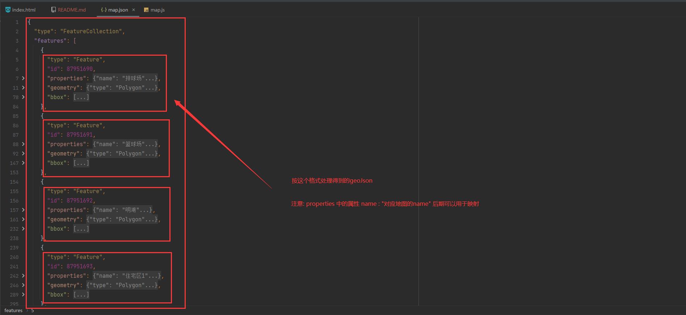

# EchartsMap

#### 介绍
用echarts制作的任意地图学习前端练手小项目仓库.

#### 技术栈
HTML,JS,CSS,Echarts

#### 安装教程

```bash
# 克隆项目
git clone https://gitee.com/mozhnegwu/echarts-map.git
```

#### 使用方法

1. 获取需要的地图geoJson

   [**阿里云数据可视化平台**](https://datav.aliyun.com/portal/school/atlas/area_selector)	

2. 将得到的geoJson处理后放到 EchartsMap/geoJson/map.json 中即可

3. 核心都在EchartsMap/js/map.js中,修改对应的映射和数据集即可

4. 已经写好了注释可以参照修改